Mechanical designs for Ani-B project
============

**Introduction**
---------------

Welcome to the **A.n.i B** Mechanical Design repository. This repository contains designs for various mechanical components, including base enclosures, actuator enclosures, computing module enclosure, PCB holders and battery compartment.

**Table of Contents**
-------------------

1. [Overview](#overview)
2. [Design Process](#design-process)
3. [Component List](#component-list)

### Overview

This repository aims to provide a collection of mechanical designs that can be used to build the body of the A.n.i B computer. The designs are created using FreeCAD software and are intended to be manufactured on a CNC machine or 3D printer.

### Design Process

The design process typically involves the following steps:

1. **Conceptualization**
2. **Parametric modeling**
3. **Simulation**: ToDo
4. **Prototyping**:  The designs are intended to be carved from alluminum blocks on a CNC machine. It is recommended to 3D print the Top compartments to reduce the weight and material saving.

### Component List

Below is a list of components currently available in this repository:

* **Base closure**
	+ Bottom cover the holds the Power Circuity
    + 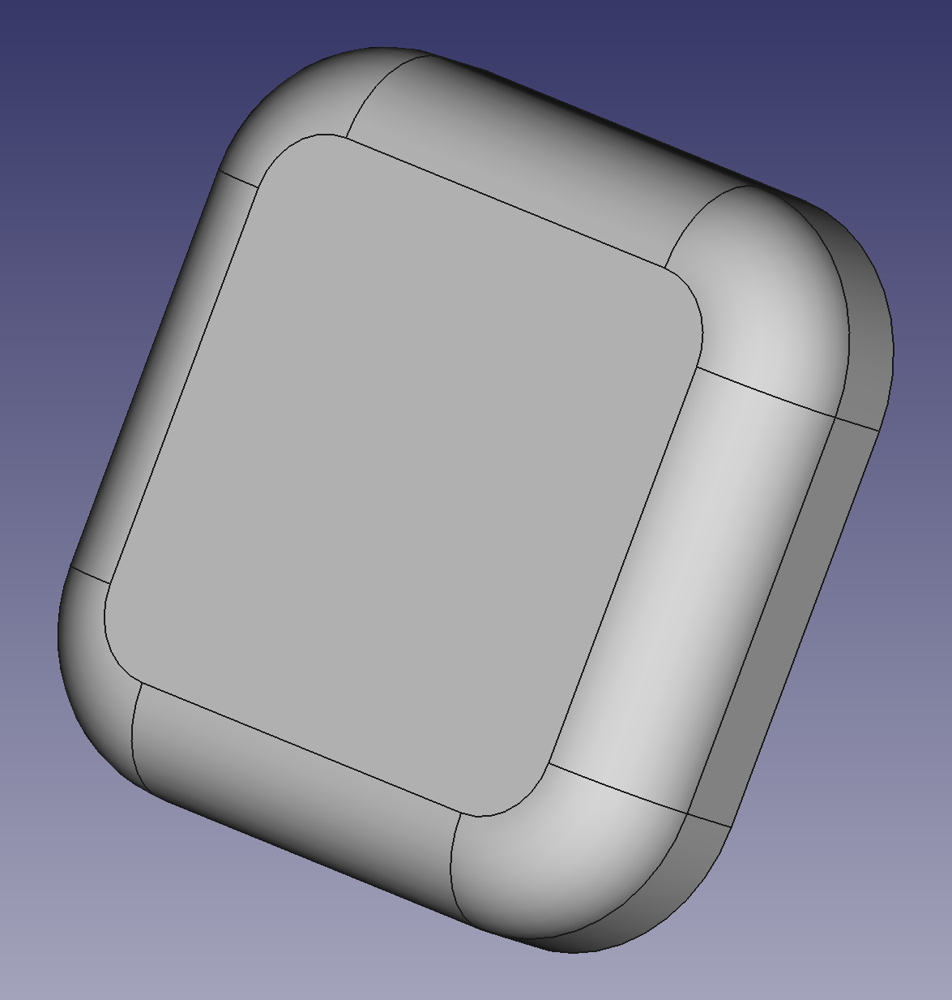
* **Base Centre Case**
	+ Base centre case that holds the base servo and battery compartment
    + 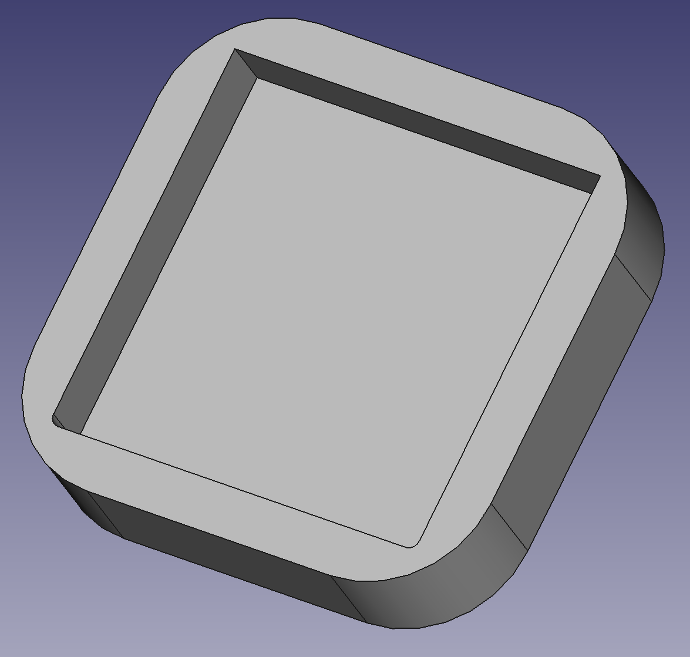
* **Base Top Case**
	+ Base top case the holds the servo bearing
    + 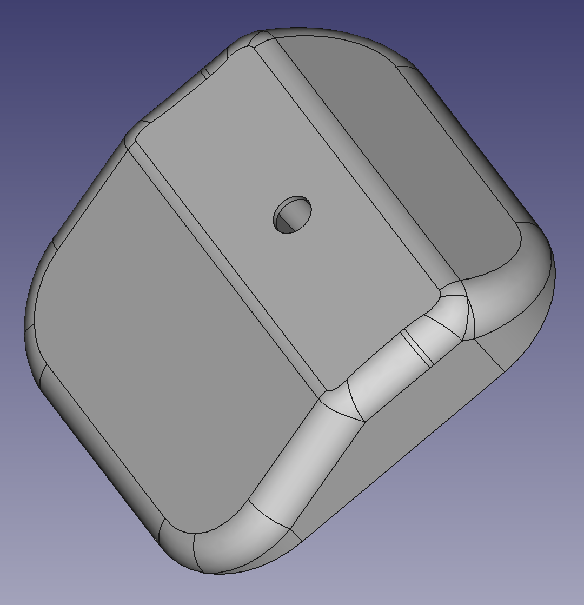
* **Servo bearing cap**
	+ Bearing cap for Lean and Lift servos
    + 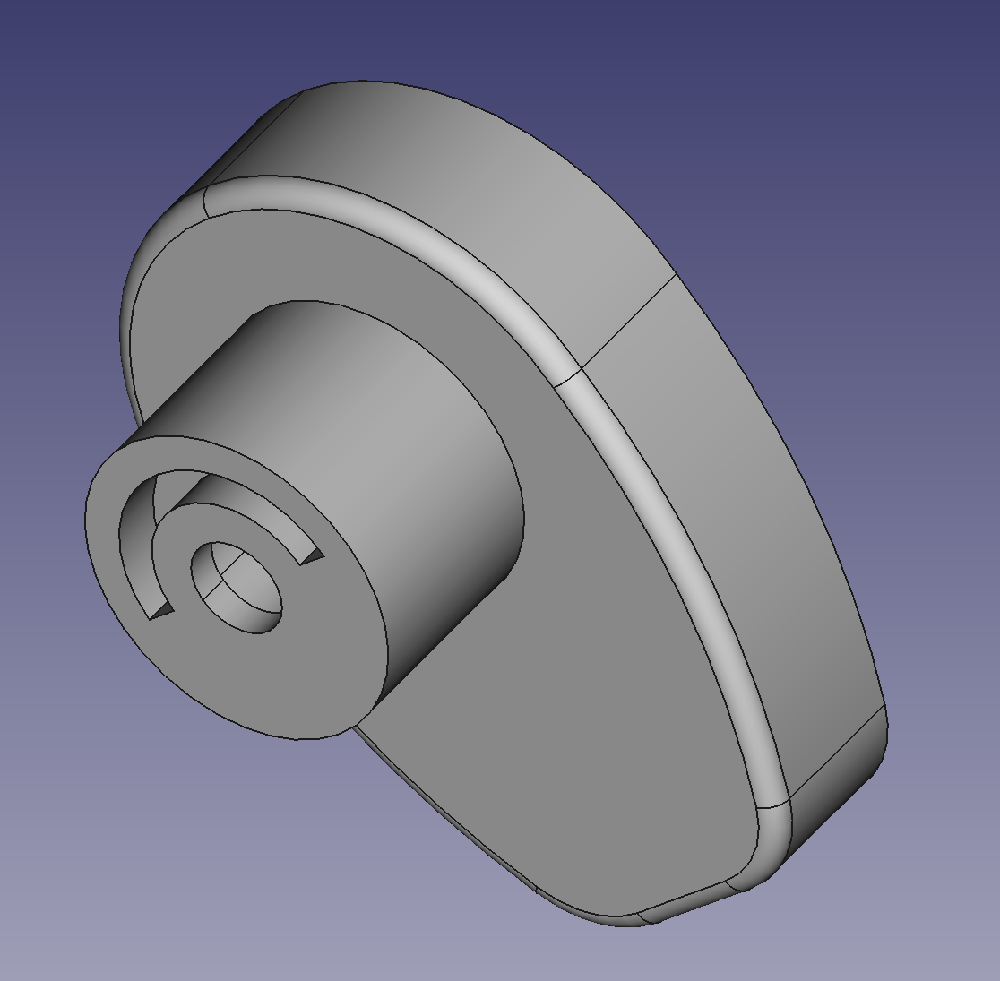
* **Servo enclosure**
	+ Servo and driver enclosure for for Lean and Lift servos
    + 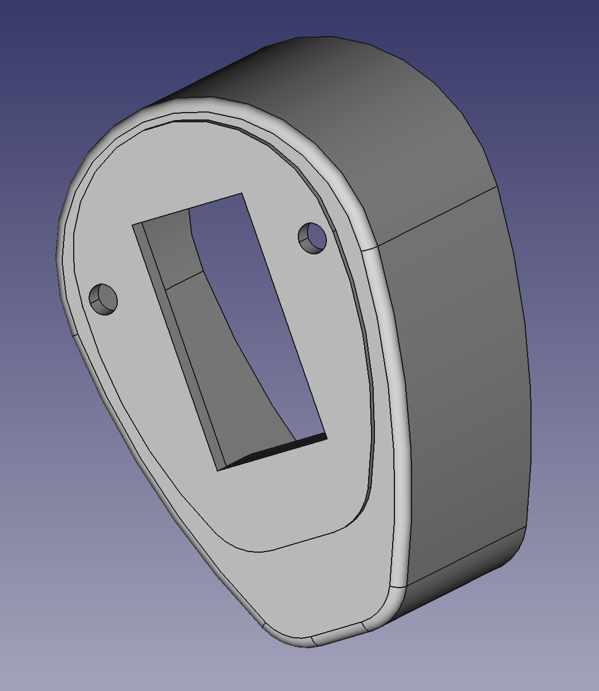
* **Servo enclosure cap**
	+ Back cap for Lean and Lift servo enclosures
    + 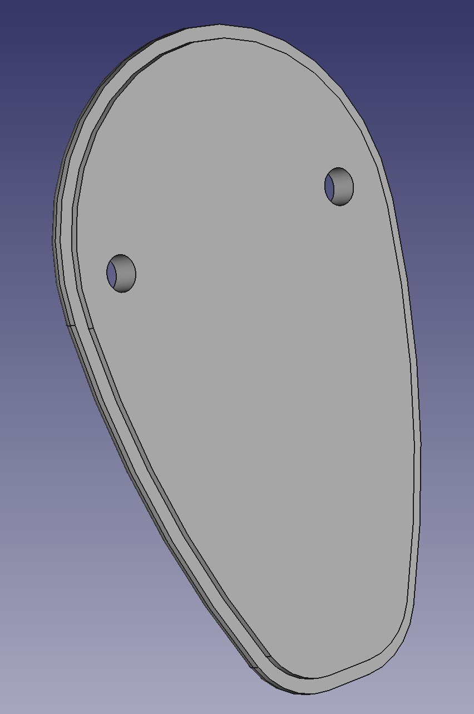
* **Top case**
	+ Top case that holds the top servo, single board compute,
    speaker etc.,
    + 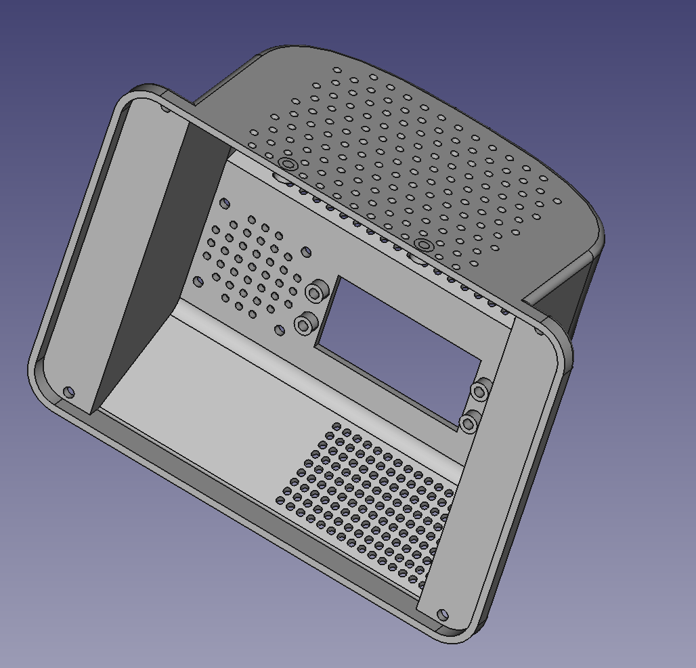
* **Face Frame**
	+ Holds the display and closes the top enclosure
    + 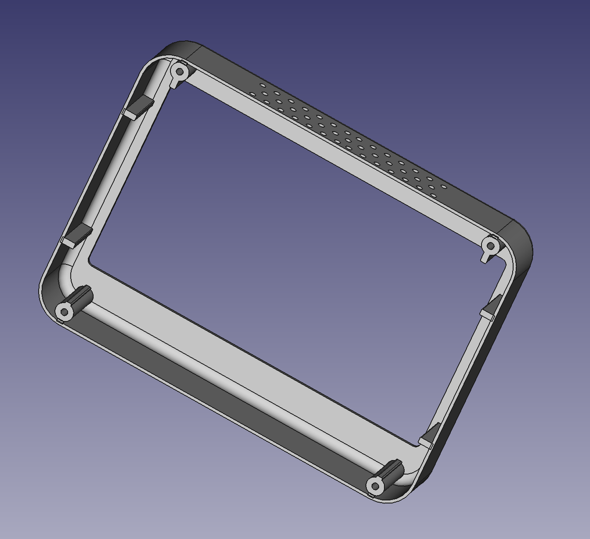
* **Servo PCB Holder**
	+ Holder for attaching servo drivers for Lean and Lift servos
    + 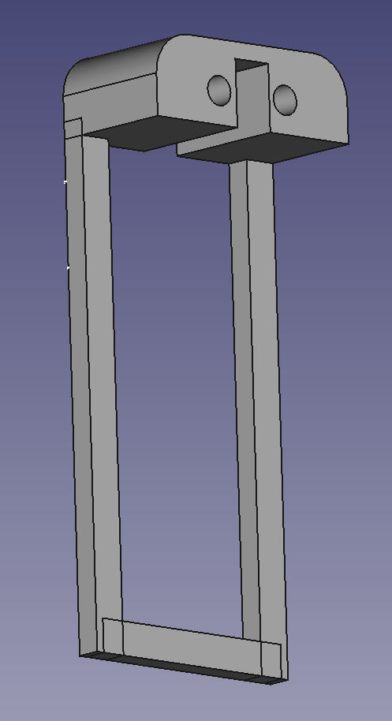
* **Base Servo PCB Holder**
	+ Holder for attaching servo drivers for base servo
    + 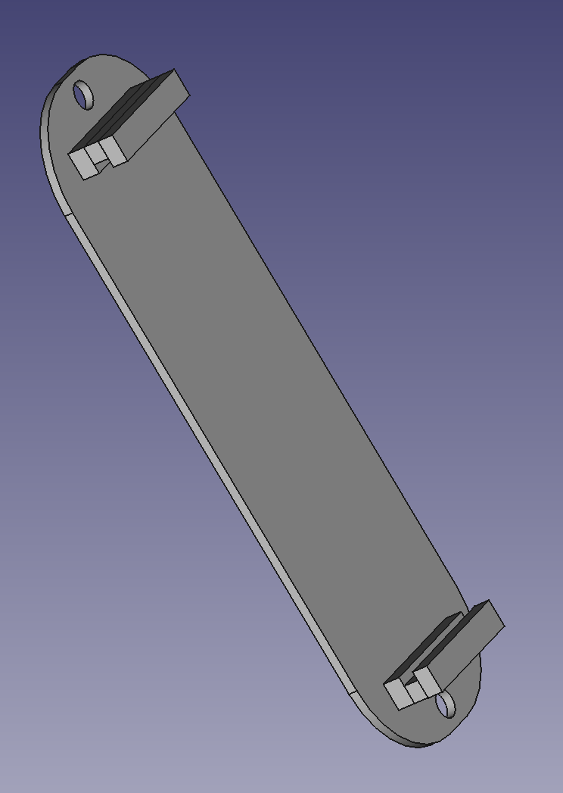
* **Battery Compartment**
	+ Holder for 3S 18650 batteryies with hoolders
    + 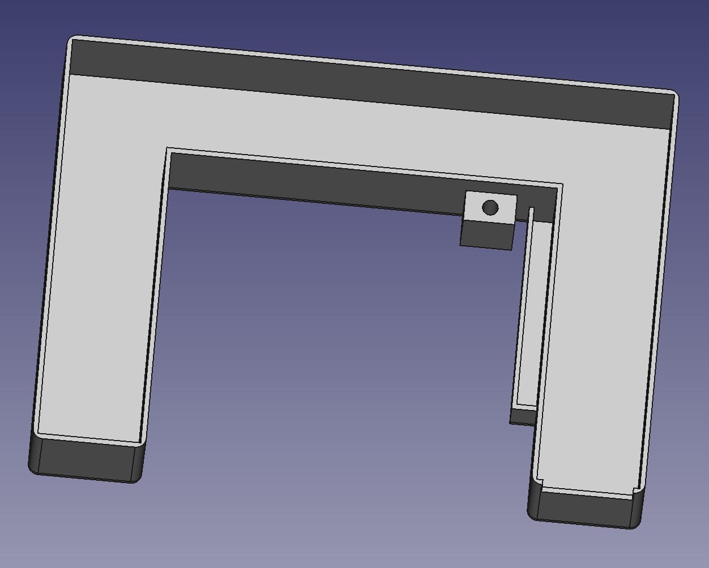

**How to Contribute**
--------------------

If you would like to contribute to this repository, please follow these steps:

1. **Fork the repository**: Click the "Fork" button on GitHub to create a copy of this 
repository.
2. **Design and prototype**: Design and prototype your component using CAD software and 
manufacturing techniques.
3. **Submit a pull request**: Submit a pull request with your new design and any modifications 
you made to existing components.

**License**
-----------

This repository is licensed under the [GNU GENERAL PUBLIC LICENSE](https://github.com/itej89/ani_b_mech_designs/blob/main/LICENSE). See 
`LICENSE.md` for details.

**Acknowledgments**
------------------

* This repository is created and maintained by the original designer of A.n.i B
